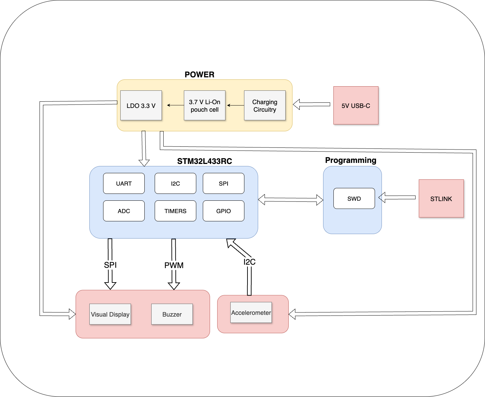
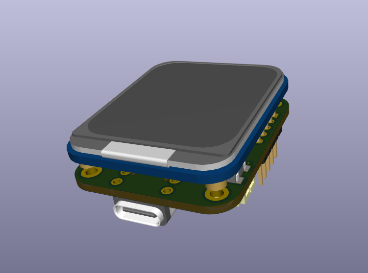
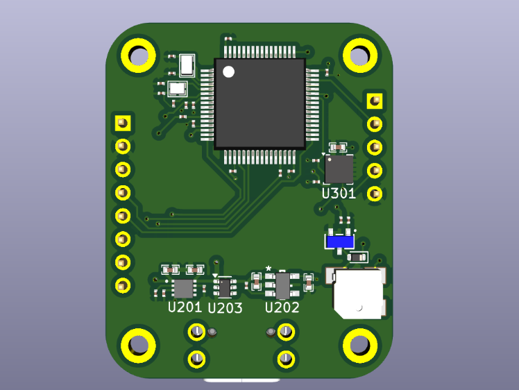
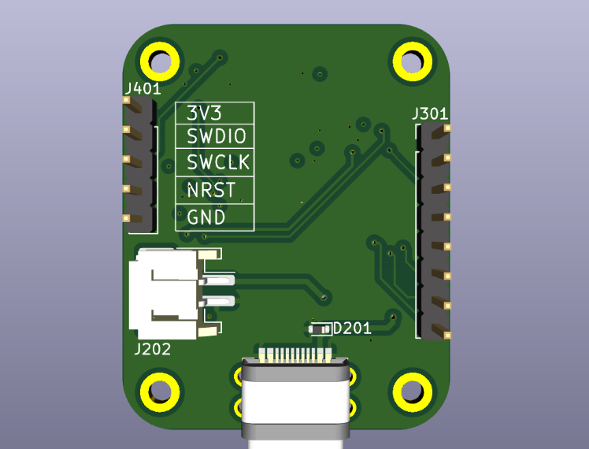
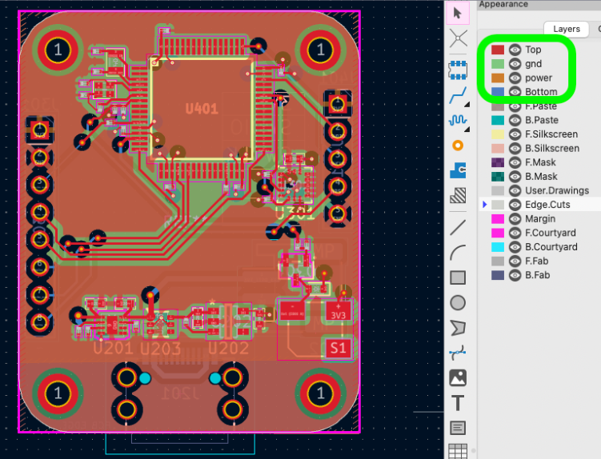
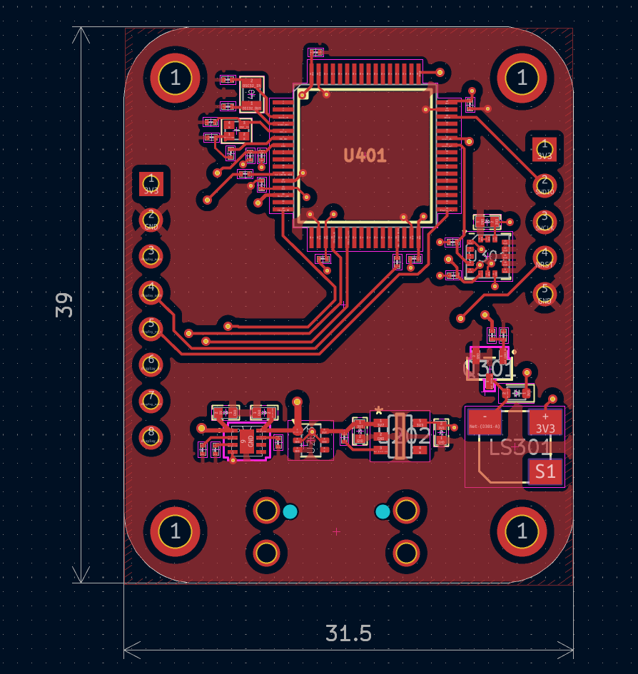
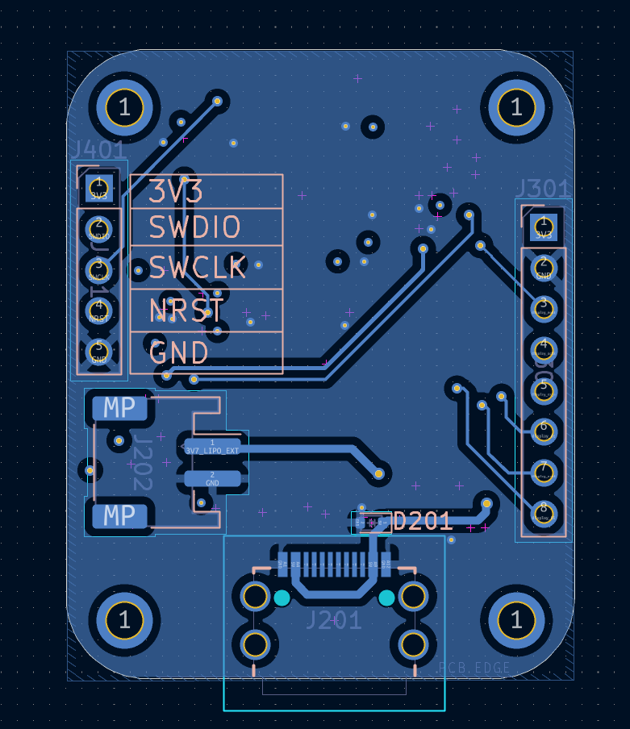
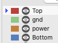

# LCD display
1.69" LCD display PCB with on-board accelerometer, buzzer, and debugging interface

## Feature Summary
- **Rechargeable 3.7V LiPo battery cell:** 320 mAh battery pack, charged via USB-C (fits under PCB)
  - Reverse-polarity protection (ideal diode) + regulation
- **Accelerometer:** 3-axis accelerometer via **I2C** for motion detection
- **Buzzer:** magnetic buzzer via **PWM** (frequency control for tone/volume), **flyback diode** for inductive kickback protection
- **Display:** 1.69" LCD via **4-wire SPI**
- **Debug:** SWD header (3V3, SWDIO, SWCLK, NRST, GND)

---

## System Overview (Block Diagram)
High-level architecture showing power path + STM32 peripherals (SPI display, I2C accel, PWM buzzer, SWD debug).

---

## Mechanical / Assembly View
Stacked assembly render showing the compact form factor and how the display sits above the PCB.

---

## 3D PCB Renders

### Component Side (MCU + power + sensor/buzzer circuitry)
3D render of the main board side with the STM32 and supporting circuitry.

### Connector Side (USB-C + SWD header access)
3D render showing USB-C placement and the SWD/debug header labeling.

---

## PCB Layout (KiCad)

### Overall routed layout (all layers visible)
Screenshot of the routed board in KiCad (routing + pours + placement).

### Top layer (routing + pours) + board dimensions
Top copper view with pours and routing, including overall board dimensions.

### Bottom layer (routing + pours)
Bottom copper view showing routing/pours on the underside.

### Layer legend used in screenshots
Reference legend for the layer colors used in the KiCad screenshots.

